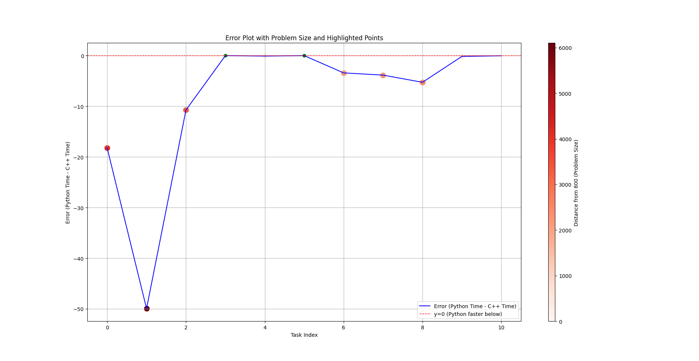
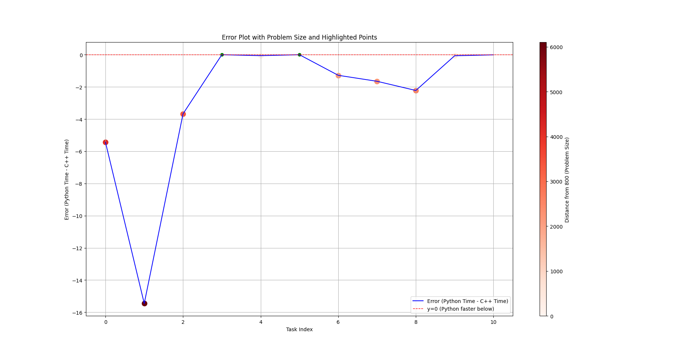
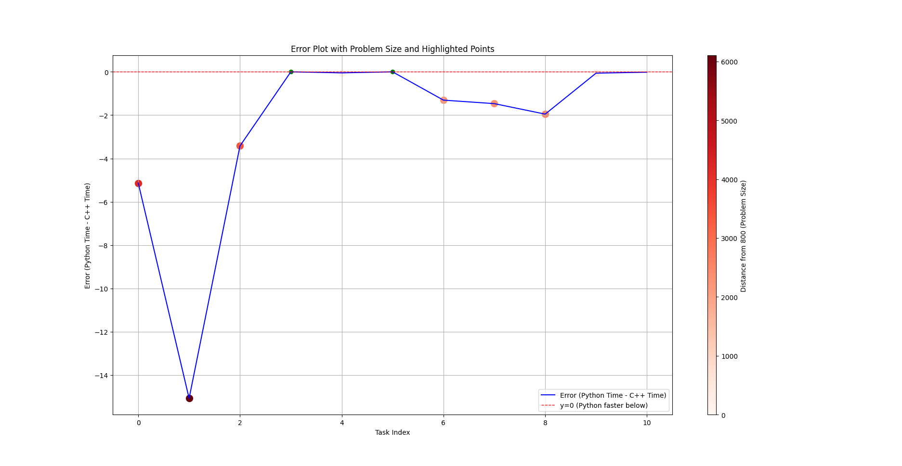

# Practical Assignment of Multithreading


This is a practical assignment where the goal is to:

1. **Use UV** to manage a project and its dependencies.
2. **Create a Queue Manager, Boss, and Minion architecture** in order to perform tasks.
3. **Use Minions in Python and C++** to carry out performance measurements.

---

## Table of Contents
- [Dependencies](#dependencies)
- [Installation and Setup](#installation-and-setup)
- [Start the every necessary bits of the app](#tarttheeverynecessarybitsoftheapp)
- [Tests, Results and Conclusions ](#testsresultsandconclusions)

---

## Dependencies

This project was built using:
- [Python 3.10](https://www.python.org/downloads/release/python-3100/)
- [curl](https://curl.se/)
- [uv](https://github.com/astral-sh/uv)
- [C++]()
- [CPR](https://github.com/libcpr/cpr)
- [json from nlohmann](https://github.com/nlohmann/json)
- [Eigen](https://eigen.tuxfamily.org)
---

## Installation and Setup

This section provide step-by-step instructions for installing and setting up the project on a Debian based Linux distro.

### Installing the Dependencies

Open a terminal and type the following commands:

```bash
# Install uv
curl -LsSf https://astral.sh/uv/install.sh | sh

# Clone the repository
git clone https://github.com/Andy-Mod/multithreading_3A

# Navigate to the project directory
cd multithreading_3A

# Sync uv
uv sync
```

## Start the every necessary bits of the app
Open a new terminal and type the following commands:
```bash
# Navigate to the project directory
cd multithreading_3A

# Give the right to the start script to be excecuted
chmod +x start.sh

# Launch the script
./start.sh
```

## Tests Results and Conclusions

### Performance Results Overview

#### Impact of `CMAKE_BUILD_TYPE`
Performance varies significantly depending on whether `CMAKE_BUILD_TYPE` is set to `Release` or not.

#### Choice of Eigen Solvers
We evaluated the performance using two Eigen solvers:
- `colPivHouseholderQr`
- `householderQr`

These solvers were chosen for the following reasons:
1. **Accuracy**: According to the Eigen documentation, these solvers provide high accuracy and do not require the input matrix `A` to meet specific conditions such as being:
   - Invertible
   - Positive definite
   - Negative definite
   - Semi-definite
2. **Prioritizing Accuracy Over Speed**: While other solvers may offer better performance, our focus was on maintaining accuracy without compromising computational integrity.

The following sections compare the results before and after setting `CMAKE_BUILD_TYPE` to `Release`, using the `colPivHouseholderQr` solver.

The testing was performed on a set of tasks with the following sizes: `sizes = [9990, 6900, 4200, 100, 1000, 10000, 2989, 3080, 8398, 1162, 761]`. These tasks were executed first in `C++` using a `Minion` and then in `Python`.


#### Tests using the solver `colPivHouseholderQr`

In `Debug` build type, here are the results we got:

```bash
Results in C++
Task Job of size 4990 completed, Time: 19.03981 seconds
Task Job of size 6900 completed, Time: 52.26729 seconds
Task Job of size 4200 completed, Time: 12.90094 seconds
Task Job of size 100 completed, Time: 0.00021 seconds
Task Job of size 1000 completed, Time: 0.12074 seconds
Task Job of size 10 completed, Time: 0.00001 seconds
Task Job of size 2989 completed, Time: 4.39684 seconds
Task Job of size 3080 completed, Time: 4.97558 seconds
Task Job of size 3398 completed, Time: 6.71316 seconds
Task Job of size 1162 completed, Time: 0.17252 seconds
Task Job of size 761 completed, Time: 0.04599 seconds

Results in Python
Task Job of size 4990 completed, Time: 1.01192 seconds
Task Job of size 6900 completed, Time: 2.38095 seconds
Task Job of size 4200 completed, Time: 0.66579 seconds
Task Job of size 100 completed, Time: 0.00043 seconds
Task Job of size 1000 completed, Time: 0.03289 seconds
Task Job of size 10 completed, Time: 0.00008 seconds
Task Job of size 2989 completed, Time: 0.33147 seconds
Task Job of size 3080 completed, Time: 0.29531 seconds
Task Job of size 3398 completed, Time: 0.40043 seconds
Task Job of size 1162 completed, Time: 0.03788 seconds
Task Job of size 761 completed, Time: 0.03169 seconds
```


As illustrated in the figure above, the tasks are generally faster in `Python`. The performance gap becomes more pronounced as the problem size increases.

For instance:
- Smaller tasks, such as tasks 10, 100, and 761, showed similar execution times in both `C++` and `Python`.
- In contrast, larger tasks like task 6900 took significantly longer in `C++`, exceeding by more that 47 seconds.

Switching to `CMAKE_BUILD_TYPE Release`, here are the results :

```bash
Results in C++
Task Job of size 4990 completed, Time: 19.07497 seconds
Task Job of size 6900 completed, Time: 51.99233 seconds
Task Job of size 4200 completed, Time: 11.24308 seconds
Task Job of size 100 completed, Time: 0.00021 seconds
Task Job of size 1000 completed, Time: 0.11298 seconds
Task Job of size 10 completed, Time: 0.00001 seconds
Task Job of size 2989 completed, Time: 3.80055 seconds
Task Job of size 3080 completed, Time: 4.09021 seconds
Task Job of size 3398 completed, Time: 5.58099 seconds
Task Job of size 1162 completed, Time: 0.17842 seconds
Task Job of size 761 completed, Time: 0.05037 seconds

Results in Python
Task Job of size 4990 completed, Time: 0.86111 seconds
Task Job of size 6900 completed, Time: 2.03398 seconds
Task Job of size 4200 completed, Time: 0.50557 seconds
Task Job of size 100 completed, Time: 0.00054 seconds
Task Job of size 1000 completed, Time: 0.03037 seconds
Task Job of size 10 completed, Time: 0.00010 seconds
Task Job of size 2989 completed, Time: 0.39521 seconds
Task Job of size 3080 completed, Time: 0.24433 seconds
Task Job of size 3398 completed, Time: 0.31616 seconds
Task Job of size 1162 completed, Time: 0.03170 seconds
Task Job of size 761 completed, Time: 0.01921 seconds
```



As observed, there are performance improvements, with execution times in `C++` generally being slightly faster. However, `C++` remains overall slower than `Python`.

#### Tests using the solver `householderQr`

In `Debug` build type, using the solver `householderQr`, here are results:

```bash
Results in C++
Task Job of size 4990 completed, Time: 6.42304 seconds
Task Job of size 6900 completed, Time: 17.74130 seconds
Task Job of size 4200 completed, Time: 4.27587 seconds
Task Job of size 100 completed, Time: 0.00023 seconds
Task Job of size 1000 completed, Time: 0.07441 seconds
Task Job of size 10 completed, Time: 0.00001 seconds
Task Job of size 2989 completed, Time: 1.54570 seconds
Task Job of size 3080 completed, Time: 1.91599 seconds
Task Job of size 3398 completed, Time: 2.57386 seconds
Task Job of size 1162 completed, Time: 0.10068 seconds
Task Job of size 761 completed, Time: 0.02846 seconds

Results in Python
Task Job of size 4990 completed, Time: 0.99126 seconds
Task Job of size 6900 completed, Time: 2.28765 seconds
Task Job of size 4200 completed, Time: 0.60514 seconds
Task Job of size 100 completed, Time: 0.00042 seconds
Task Job of size 1000 completed, Time: 0.01687 seconds
Task Job of size 10 completed, Time: 0.00010 seconds
Task Job of size 2989 completed, Time: 0.26690 seconds
Task Job of size 3080 completed, Time: 0.26509 seconds
Task Job of size 3398 completed, Time: 0.35297 seconds
Task Job of size 1162 completed, Time: 0.03539 seconds
Task Job of size 761 completed, Time: 0.02135 seconds
```



Compared to the `colPivHouseholderQr` solver, we observe significant speed improvements. However, `Python` executions remain overall faster and more accurate.

In `Release` build type, here are the results we got:

```bash
Results in C++
Task (Job of size 4990) completed, Time: 6.28549 seconds
Task (Job of size 6900) completed, Time: 17.91013 seconds
Task (Job of size 4200) completed, Time: 4.48223 seconds
Task (Job of size 100) completed, Time: 0.00017 seconds
Task (Job of size 1000) completed, Time: 0.07257 seconds
Task (Job of size 10) completed, Time: 0.00001 seconds
Task (Job of size 2989) completed, Time: 1.57316 seconds
Task (Job of size 3080) completed, Time: 1.90423 seconds
Task (Job of size 3398) completed, Time: 2.70312 seconds
Task (Job of size 1162) completed, Time: 0.11068 seconds
Task (Job of size 761) completed, Time: 0.03303 seconds

Results in Python
Task (Job of size 4990) completed, Time: 1.04918 seconds
Task (Job of size 6900) completed, Time: 2.38014 seconds
Task (Job of size 4200) completed, Time: 0.60435 seconds
Task (Job of size 100) completed, Time: 0.00045 seconds
Task (Job of size 1000) completed, Time: 0.03385 seconds
Task (Job of size 10) completed, Time: 0.00009 seconds
Task (Job of size 2989) completed, Time: 0.28079 seconds
Task (Job of size 3080) completed, Time: 0.27920 seconds
Task (Job of size 3398) completed, Time: 0.37009 seconds
Task (Job of size 1162) completed, Time: 0.03916 seconds
Task (Job of size 761) completed, Time: 0.02060 seconds
```


As illustrated in the figure above, the tasks are still generally faster in `Python`, but performance is significantly better in `C++`, with almost the same level of accuracy.

#### Tests using the solver `householderQr` and `OpenMP` in `CMAKE_BUILD_TYPE Release`

##### Optimizing Task Execution Performance in `C++`

In this section, we aim to optimize the performance of task execution in `C++` by enabling parallel computation in `Eigen` using `OpenMP`. Parallelization should improve the speed of the operations, especially for large size problems.

###### Approach

We will evaluate the performance using different numbers of threads:
- **2 threads**
- **4 threads**
- **8 threads**

The results will then be compared individually to the performance of tasks executions in `Python`.

Here are the results with :
- **2 threads**
```bash
Results in C++
Task (Job of size 4990) completed, Time: 6.46503 seconds
Task (Job of size 6900) completed, Time: 20.55875 seconds
Task (Job of size 4200) completed, Time: 3.80499 seconds
Task (Job of size 100) completed, Time: 0.00018 seconds
Task (Job of size 1000) completed, Time: 0.05961 seconds
Task (Job of size 10) completed, Time: 0.00001 seconds
Task (Job of size 2989) completed, Time: 1.38862 seconds
Task (Job of size 3080) completed, Time: 1.51842 seconds
Task (Job of size 3398) completed, Time: 2.01863 seconds
Task (Job of size 1162) completed, Time: 0.08772 seconds
Task (Job of size 761) completed, Time: 0.02830 seconds

Results in Python
Task (Job of size 4990) completed, Time: 0.96055 seconds
Task (Job of size 6900) completed, Time: 1.94416 seconds
Task (Job of size 4200) completed, Time: 0.52031 seconds
Task (Job of size 100) completed, Time: 0.00761 seconds
Task (Job of size 1000) completed, Time: 0.04158 seconds
Task (Job of size 10) completed, Time: 0.00007 seconds
Task (Job of size 2989) completed, Time: 0.22844 seconds
Task (Job of size 3080) completed, Time: 0.23131 seconds
Task (Job of size 3398) completed, Time: 0.30405 seconds
Task (Job of size 1162) completed, Time: 0.02971 seconds
Task (Job of size 761) completed, Time: 0.01507 seconds
```


Overall, we observe significant speed improvements. However, `Python` executions remain overall faster and more accurate.

- **4 threads**
```bash
Results in C++
Task (Job of size 4990) completed, Time: 6.46503 seconds
Task (Job of size 6900) completed, Time: 20.55875 seconds
Task (Job of size 4200) completed, Time: 3.80499 seconds
Task (Job of size 100) completed, Time: 0.00018 seconds
Task (Job of size 1000) completed, Time: 0.05961 seconds
Task (Job of size 10) completed, Time: 0.00001 seconds
Task (Job of size 2989) completed, Time: 1.38862 seconds
Task (Job of size 3080) completed, Time: 1.51842 seconds
Task (Job of size 3398) completed, Time: 2.01863 seconds
Task (Job of size 1162) completed, Time: 0.08772 seconds
Task (Job of size 761) completed, Time: 0.02830 seconds

Results in Python
Task (Job of size 4990) completed, Time: 0.96055 seconds
Task (Job of size 6900) completed, Time: 1.94416 seconds
Task (Job of size 4200) completed, Time: 0.52031 seconds
Task (Job of size 100) completed, Time: 0.00761 seconds
Task (Job of size 1000) completed, Time: 0.04158 seconds
Task (Job of size 10) completed, Time: 0.00007 seconds
Task (Job of size 2989) completed, Time: 0.22844 seconds
Task (Job of size 3080) completed, Time: 0.23131 seconds
Task (Job of size 3398) completed, Time: 0.30405 seconds
Task (Job of size 1162) completed, Time: 0.02971 seconds
Task (Job of size 761) completed, Time: 0.01507 seconds
```



Overall, we observe significant speed improvements. However, `Python` executions remain overall faster and more accurate.

- **8 threads**
```bash
Results in C++
Task (Job of size 4990) completed, Time: 6.46503 seconds
Task (Job of size 6900) completed, Time: 20.55875 seconds
Task (Job of size 4200) completed, Time: 3.80499 seconds
Task (Job of size 100) completed, Time: 0.00018 seconds
Task (Job of size 1000) completed, Time: 0.05961 seconds
Task (Job of size 10) completed, Time: 0.00001 seconds
Task (Job of size 2989) completed, Time: 1.38862 seconds
Task (Job of size 3080) completed, Time: 1.51842 seconds
Task (Job of size 3398) completed, Time: 2.01863 seconds
Task (Job of size 1162) completed, Time: 0.08772 seconds
Task (Job of size 761) completed, Time: 0.02830 seconds

Results in Python
Task (Job of size 4990) completed, Time: 0.96055 seconds
Task (Job of size 6900) completed, Time: 1.94416 seconds
Task (Job of size 4200) completed, Time: 0.52031 seconds
Task (Job of size 100) completed, Time: 0.00761 seconds
Task (Job of size 1000) completed, Time: 0.04158 seconds
Task (Job of size 10) completed, Time: 0.00007 seconds
Task (Job of size 2989) completed, Time: 0.22844 seconds
Task (Job of size 3080) completed, Time: 0.23131 seconds
Task (Job of size 3398) completed, Time: 0.30405 seconds
Task (Job of size 1162) completed, Time: 0.02971 seconds
Task (Job of size 761) completed, Time: 0.01507 seconds
```


Overall, we observe significant speed improvements. However, `Python` executions remain overall faster and more accurate.

### Conclusion

Switching the build type of the `C++ Minion` to `Release` significantly improves performance. However, the `numpy` library remains considerably faster and more accurate compared to the `Eigen` library.

In our tests, enabling parallelism with `OpenMP` improved performance but not as much as anticipated, resulting in an overall **3% reduction in computation time**.
