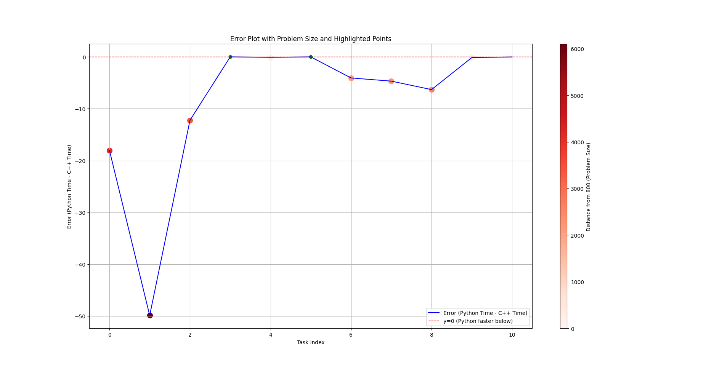
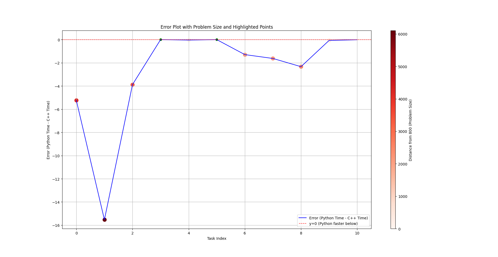

# Ingescape Karaoke App


This is a practical assignment where the goal is to:

1. **Use UV** to manage a project and its dependencies.
2. **Create a Queue Manager, Boss, and Minion architecture** in order to perform tasks.
3. **Use Minions in Python and C++** to carry out performance measurements.

---

## Table of Contents
- [Dependencies](#dependencies)
- [Installation and Setup](#installation-and-setup)
- [Start the every necessary bits of the app](#tarttheeverynecessarybitsoftheapp)
- [Tests Results and Conclusions ](#testsresultsandconclusions)

---

## Dependencies

This project was built using:
- [Python 3.10](https://www.python.org/downloads/release/python-3100/)
- [curl](https://curl.se/)
- [uv](https://github.com/astral-sh/uv)
- [C++]()
- [CPR](https://github.com/libcpr/cpr)
- [json from nlohmann](https://github.com/nlohmann/json)
- [Eigen](https://eigen.tuxfamily.org)
---

## Installation and Setup

This section provide step-by-step instructions for installing and setting up the project on a Debian based Linux distro.

### Installing the Dependencies

Open a terminal and type the following commands:

```bash
# Install uv
curl -LsSf \ https://astral.sh/uv/install.sh | sh

# Clone the repository
git clone https://github.com/Andy-Mod/multithreading_3A

# Navigate to the project directory
cd multithreading_3A

# Sync uv
uv sync
```

## Start the every necessary bits of the app
Open a new terminal and type the following commands:
```bash
# Navigate to the project directory
cd multithreading_3A

# Give the right to the start script to be excecuted
chmod +x start.sh

# Launch the script
./start.sh

# Open an other terminal, Navigate to the project directory and launch the boss
cd multithreading_3A
python3 src/boss.py

```

## Tests Results and Conclusions

### Performance Results Overview

#### Impact of `CMAKE_BUILD_TYPE`
Performance varies significantly depending on whether `CMAKE_BUILD_TYPE` is set to `Release` or not.

#### Choice of Eigen Solvers
We evaluated the performance using two Eigen solvers:
- `colPivHouseholderQr`
- `householderQr`

These solvers were chosen for the following reasons:
1. **Accuracy**: According to the Eigen documentation, these solvers provide high accuracy and do not require the input matrix `A` to meet specific conditions such as being:
   - Invertible
   - Positive definite
   - Negative definite
   - Semi-definite
2. **Prioritizing Accuracy Over Speed**: While other solvers may offer better performance, our focus was on maintaining accuracy without compromising computational integrity.

The following sections compare the results before and after setting `CMAKE_BUILD_TYPE` to `Release`, using the `colPivHouseholderQr` solver.

The testing was performed on a set of tasks with the following sizes: `sizes = [9990, 6900, 4200, 100, 1000, 10000, 2989, 3080, 8398, 1162, 761]`. These tasks were executed first in `C++` using a `Minion` and then in `Python`.


#### Tests using the solver `colPivHouseholderQr`

In `Debug` build type, here are the results we got:

```bash
Results in C++
The task Mangekyu 4990 is done. Problem size: 4990 Time taken: 18.046422958374023 seconds
The task Mangekyu 6900 is done. Problem size: 6900 Time taken: 49.5371208190918 seconds
The task Mangekyu 4200 is done. Problem size: 4200 Time taken: 10.69587516784668 seconds
The task Mangekyu 100 is done. Problem size: 100 Time taken: 0.0001717470004223287 seconds
The task Mangekyu 1000 is done. Problem size: 1000 Time taken: 0.08776196092367172 seconds
The task Mangekyu 10 is done. Problem size: 10 Time taken: 1.532600072096102e-05 seconds
The task Mangekyu 2989 is done. Problem size: 2989 Time taken: 3.662109851837158 seconds
The task Mangekyu 3080 is done. Problem size: 3080 Time taken: 3.9911484718322754 seconds
The task Mangekyu 3398 is done. Problem size: 3398 Time taken: 5.45238733291626 seconds
The task Mangekyu 1162 is done. Problem size: 1162 Time taken: 0.13735634088516235 seconds
The task Mangekyu 761 is done. Problem size: 761 Time taken: 0.044347815215587616 seconds

Results in Python
The task Mangekyu 4990 is done. Problem size: 4990 Time taken: 0.9062296289999949 seconds
The task Mangekyu 6900 is done. Problem size: 6900 Time taken: 2.0681871809999848 seconds
The task Mangekyu 4200 is done. Problem size: 4200 Time taken: 0.5446575260000373 seconds
The task Mangekyu 100 is done. Problem size: 100 Time taken: 0.0004199890000791129 seconds
The task Mangekyu 1000 is done. Problem size: 1000 Time taken: 0.020756837000021733 seconds
The task Mangekyu 10 is done. Problem size: 10 Time taken: 0.0032047280000142564 seconds
The task Mangekyu 2989 is done. Problem size: 2989 Time taken: 0.24341484499996113 seconds
The task Mangekyu 3080 is done. Problem size: 3080 Time taken: 0.24024804700002278 seconds
The task Mangekyu 3398 is done. Problem size: 3398 Time taken: 0.3160894400000416 seconds
The task Mangekyu 1162 is done. Problem size: 1162 Time taken: 0.03977131499993902 seconds
The task Mangekyu 761 is done. Problem size: 761 Time taken: 0.02647056499995415 seconds
```



As illustrated in the figure above, the tasks are generally faster in `Python`. The performance gap becomes more pronounced as the problem size increases.

For instance:
- Smaller tasks, such as tasks 10, 100, and 761, showed similar execution times in both `C++` and `Python`.
- In contrast, larger tasks like task 6900 took significantly longer in `C++`, exceeding by more that 47 seconds.

Switching to `CMAKE_BUILD_TYPE Release` improves performance, with execution times in `C++` being overall a litle bit faster.

#### Tests using the solver `householderQr`

In `Release` build type, here are the results we got:

```bash
Results in C++
The task Mangekyu 4990 is done. Problem size: 4990 Time taken: 6.519332408905029 seconds
The task Mangekyu 6900 is done. Problem size: 6900 Time taken: 17.61880874633789 seconds
The task Mangekyu 4200 is done. Problem size: 4200 Time taken: 3.558016061782837 seconds
The task Mangekyu 100 is done. Problem size: 100 Time taken: 0.0004950279835611582 seconds
The task Mangekyu 1000 is done. Problem size: 1000 Time taken: 0.05092376098036766 seconds
The task Mangekyu 10 is done. Problem size: 10 Time taken: 2.5274999643443152e-05 seconds
The task Mangekyu 2989 is done. Problem size: 2989 Time taken: 1.2689995765686035 seconds
The task Mangekyu 3080 is done. Problem size: 3080 Time taken: 1.3877800703048706 seconds
The task Mangekyu 3398 is done. Problem size: 3398 Time taken: 1.9178365468978882 seconds
The task Mangekyu 1162 is done. Problem size: 1162 Time taken: 0.07842449843883514 seconds
The task Mangekyu 761 is done. Problem size: 761 Time taken: 0.022380823269486427 seconds
Results in Python

The task Mangekyu 4990 is done. Problem size: 4990 Time taken: 0.7084680450006999 seconds
The task Mangekyu 6900 is done. Problem size: 6900 Time taken: 1.7782297870007824 seconds
The task Mangekyu 4200 is done. Problem size: 4200 Time taken: 0.45709889699992345 seconds
The task Mangekyu 100 is done. Problem size: 100 Time taken: 0.0003332780006530811 seconds
The task Mangekyu 1000 is done. Problem size: 1000 Time taken: 0.02459754099982092 seconds
The task Mangekyu 10 is done. Problem size: 10 Time taken: 6.231399947864702e-05 seconds
The task Mangekyu 2989 is done. Problem size: 2989 Time taken: 0.20673104999968928 seconds
The task Mangekyu 3080 is done. Problem size: 3080 Time taken: 0.211836890000086 seconds
The task Mangekyu 3398 is done. Problem size: 3398 Time taken: 0.2810321280003336 seconds
The task Mangekyu 1162 is done. Problem size: 1162 Time taken: 0.035492132999934256 seconds
The task Mangekyu 761 is done. Problem size: 761 Time taken: 0.02322438300052454 seconds
```



As illustrated in the figure above, the tasks are still generally faster in `Python`, but performance is significantly better in `C++`, with almost the same level of accuracy.

### Conclusion

Overall, switching the build type of the `C++ Minion` to `Release` improves performance. However, it is important to note that the `numpy` library is significantly faster and more accurate than the `Eigen` library.
